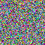
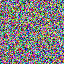

# Python based Invertible-PRNG

Python based invertible multi-precision pseudo random number generator inspired by the website [Library of Babel Image Archives](http://babelia.libraryofbabel.info/) made by [Jonathan Basile](https://jonathanbasile.com/)

Decided to try and make it in python as it doesnt have a max int value. 

### Examples

Encoding the number 1 and desplaying the image gives us [this image](./encoding_1.png)

Encoding the number 2 and desplaying the image gives us [this image](./encoding_2.png)

Numbers from 0 to 999 have been generated inside [the images folder](/images).

## Next steps

I need to add more randomness in the 0 case as can be seen in this image:

I also want to make it so you could change the number of bits used for color (maybe even a colour picker so its a user defined palette), the size of the image and enable transparency. The code should adapt and calculate new constants for the PRNG that would make it invertible.

I will probably take a small break from this code as I want to do a project in C++ next.

If you want to contact me for questions you can do so at [karlo.mohenski@gmail.com](mailto:karlo.mohenski@gmail.com).
